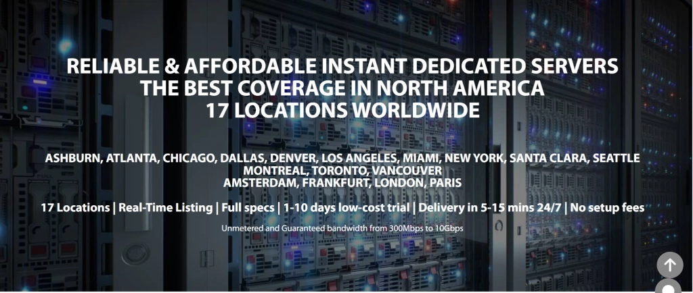

# GTHost Review: Global Server Coverage for Faster Website Performance

Are your customers scattered across different continents? Struggling with slow loading speeds because your servers are too far from your audience? Planning to expand internationally while maintaining lightning-fast performance?

**We found a hosting solution that bridges geographical gaps without compromising speed.**

GTHost is a hosting provider that helps you reach the remotest corners of our planet while delivering excellent speed. This platform offers servers based on your storage needs and preferred location, giving you the flexibility to build infrastructure that matches your business reach.

---

## Overview of GTHost

GTHost, or GLOBALTELEHOST Corp., was **founded in 2012** with a mission to deliver optimal and affordable hosting services worldwide. This hosting platform operates more than 17 data center locations around the globe.

You can select a server on this hosting platform according to your storage requirements and location preferences. Here, you get the opportunity to build your plans based on your server needs. So let's explore what makes GTHost stand out.

## GTHost Data Center Locations

GTHost's 17+ data centers are strategically positioned across multiple continents, providing you with extensive geographical coverage for your hosting needs.

This wide distribution of servers means you can place your website infrastructure closer to your target audience, regardless of where they're located. Whether your customers are in North America, Europe, Asia, or elsewhere, GTHost has you covered.

## Security Analysis

Your data represents months or years of hard work and drives most of your business operations. Naturally, you need it protected.

GTHost takes security seriously by offering DDoS attack protection while also preventing users from launching attacks on others. All your data remains encrypted with SSL software provided by the platform, ensuring your information stays secure and confidential.

## Customer Support Analysis

We understand that adapting to a new hosting service provider can be challenging, especially in those early days when you're still figuring things out.

That's where GTHost's 24/7 customer support team comes in. You can reach them through calls, live chat, or emails whenever you need assistance. No matter what time zone you're in, help is always available.

## GTHost Key Features

**Let's break down the standout features that make GTHost worth considering.**

### Unlimited Bandwidth

Worried about exceeding bandwidth limits and facing extra charges? Concerned that overage fees might hold your business back from scaling? 

With GTHost, those concerns disappear. This hosting platform doesn't impose limits or extra fees on your bandwidth consumption. You can grow without worrying about surprise costs.

### Instant Setup

Time is money, especially when you're eager to launch your online presence. Why waste hours or days waiting for server configuration?

GTHost helps you set up your server within 5-15 minutes after purchase. No lengthy waiting periods—just quick deployment so you can start working immediately.

### Full Root Access

If you prefer maintaining complete control over your server without uninformed changes happening behind your back, GTHost delivers exactly that.

This hosting platform offers full root access, meaning you have complete control over your server environment. You decide what changes to make and when to make them.

## Types of Hosting Plans GTHost Offers

GTHost primarily offers dedicated server plans tailored to your storage requirements and location preferences. You can build the plan you need, so pricing depends on your specific choices.

This flexibility means you're not forced into pre-packaged plans that include features you don't need. Instead, you pay for what matters to your business.

👉 [Looking for global server coverage with flexible configurations? Discover how GTHost can accelerate your website performance worldwide](https://cp.gthost.com/en/join/72c7e6b2fc118929f9ede2978f008806)

## Do We Recommend GTHost for Dedicated Servers?

Yes, we recommend GTHost for dedicated servers. This hosting platform provides an extensive range of server locations, allowing you to choose your preferred region and storage requirements. You get the opportunity to build custom plans that fit your unique needs rather than settling for one-size-fits-all solutions.

The combination of global reach, flexible configurations, and solid security makes GTHost a viable option for businesses requiring dedicated server resources with international coverage.

## Frequently Asked Questions: GTHost Review

**Does GTHost offer a free trial?**

Not exactly a traditional free trial. GTHost offers 1-10 low-cost trial options. This might sound confusing, so check GTHost's terms of service to understand their free or discounted trial facility.

**How much does GTHost cost?**

With GTHost, you build a plan based on your needs and requirements, so pricing depends on which features you select. However, plans start at $59 per month.

**What kind of support options does GTHost provide?**

GTHost handles support requests for any server issues, whether billing or technical. This hosting platform assists you through live chat, phone calls, and emails. They provide specific email addresses for each support category.

👉 [Ready to expand your global reach? Start building your custom GTHost server configuration today](https://cp.gthost.com/en/join/72c7e6b2fc118929f9ede2978f008806)

## Conclusion: GTHost Review

Let's wrap up this GTHost review by highlighting what matters most. GTHost operates around 17 locations worldwide, which is excellent for your website since closer servers mean faster loading times for your visitors.

The platform's flexibility in building custom plans, combined with unlimited bandwidth, instant setup, and full root access, makes it particularly suitable for businesses with international audiences or expansion plans. While pricing varies based on configuration choices, the ability to tailor your hosting environment to exact specifications provides genuine value for businesses that need control and global reach.

GTHost proves itself as a solid option for dedicated server hosting, especially when geographical coverage and performance optimization are priorities. The 24/7 support ensures you're never left stranded, regardless of when issues arise or questions pop up.
